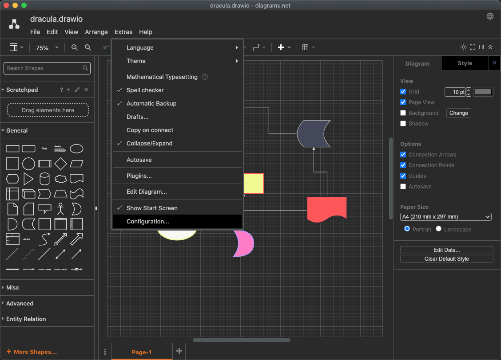
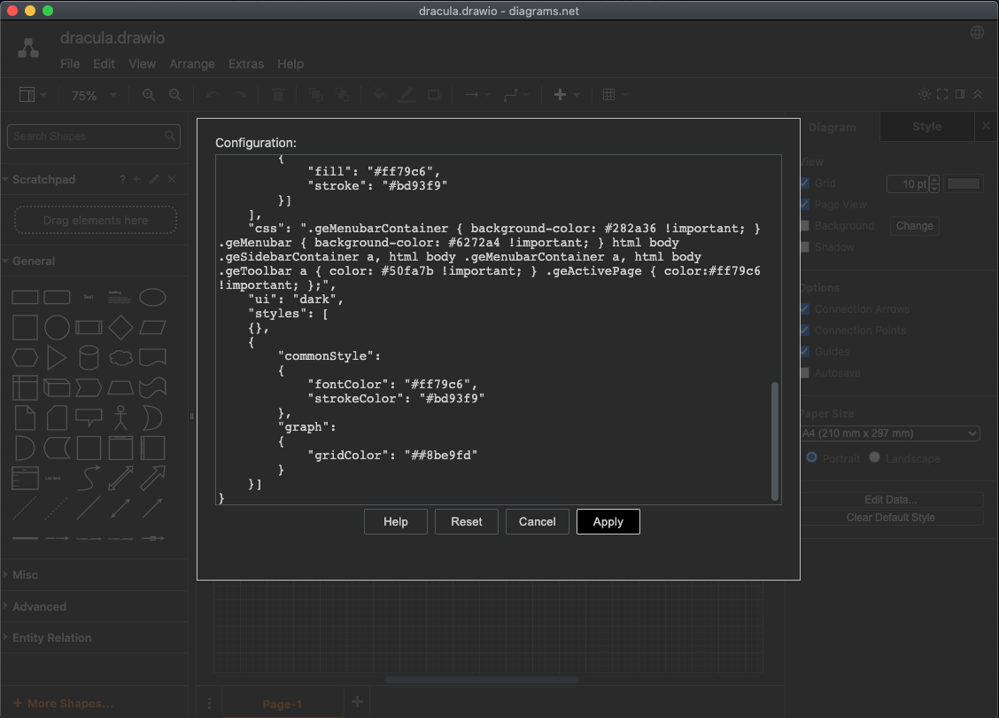
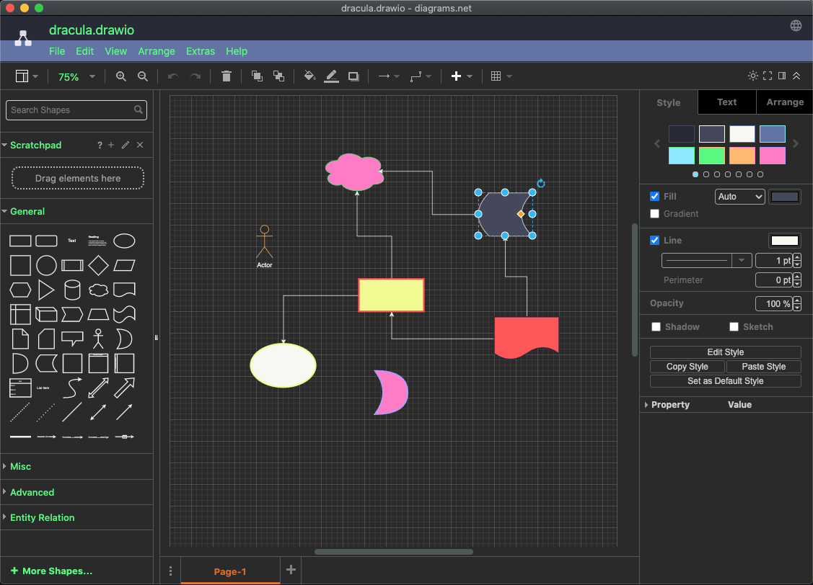

### [draw.io](https://draw.io)

#### Install using Git

If you are a git user, you can install the theme and keep up to date by cloning the repo:

    git clone https://github.com/dracula/draw.io.git

#### Install manually

Start draw.io.

Select menu Extras -> Configuration...

Copy the *content* of the file extra-configuration.json and paste it into the text area.

Press Apply.

Restart draw.io.

Enjoy.

## What is changed

Set preset colors.

Set preset styles.

Ajusted a few UI colors where possible.

## Remove Dracula Presets

Select menu Extras -> Configuration...

Clear the *content* of the text area.

Press Reset. Confirm.

Restart draw.io.

## See Also

[Configure the diagrams.net and draw.io editor](https://www.diagrams.net/doc/faq/configure-diagram-editor)