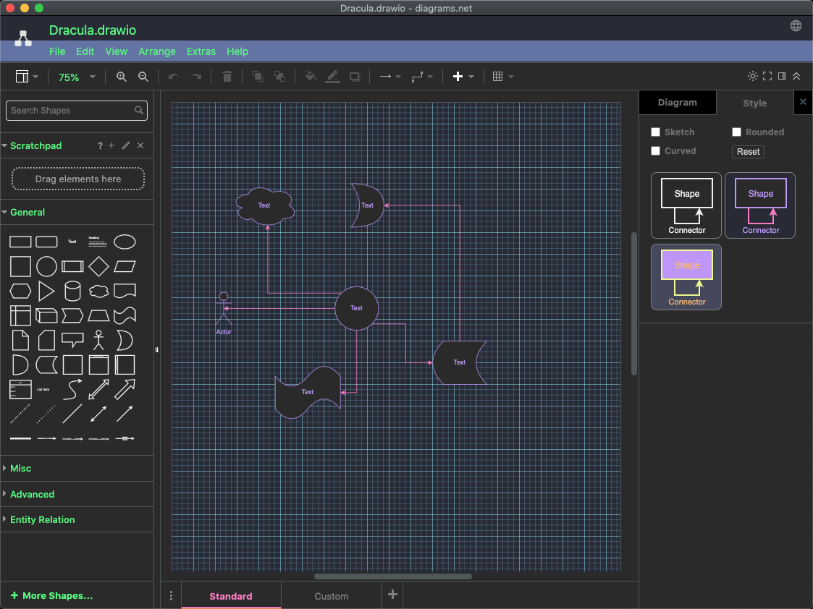

# Dracula for [Foobar](https://foobar.com)

> A dark theme for [Foobar](https://foobar.com).

## Install

All instructions can be found at [draculatheme.com/draw.io](https://draculatheme.com/draw.io).

Start draw.io.

Select Extrat -> Theme -> Dark if not already done.

Select menu Extra -> Configuration...

Copy the *content* of the file extra-configuration.json and paste it into the text area.

Press Apply.

Restart draw.io.

Enjoy.

## What is changed

Set preset colors.

Set preset styles.

Ajusted a few UI colors.

## Community

- [Twitter](https://twitter.com/draculatheme) - Best for getting updates about themes and new stuff.
- [GitHub](https://github.com/dracula/dracula-theme/discussions) - Best for asking questions and discussing issues.
- [Discord](https://draculatheme.com/discord-invite) - Best for hanging out with the community.

## License

[MIT License](./LICENSE)
